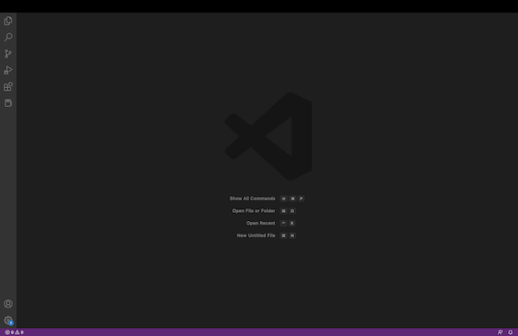
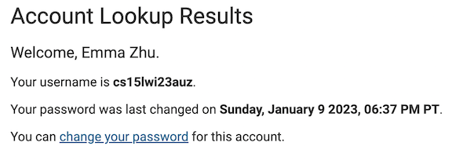
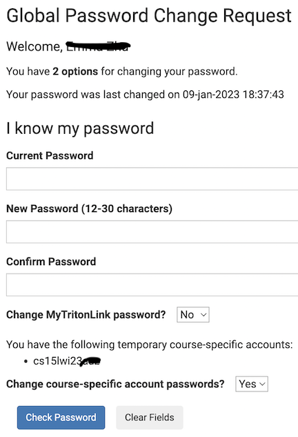
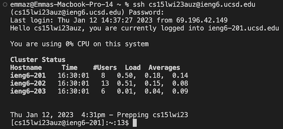

CSE 15L Week 1 Lab Report
---

During the week 1 lab of CSE 15L, we worked on downloading VSCode, logging into a remote server, as well as trying some commands within the terminal of the remote server. This report will briefly detail and describe the steps it took to complete the actions listed above. 

Downloading VSCode:
---
First, I went to the site where the link to download VSCode is located ([Link]( https://code.visualstudio.com/)). After dowloading and installing the app, I opened it and the screen looked like the image below:

Now that VSCode was downloaded, I moved onto logging into the remote server.

Remotely Connecting
---
In order to connect remotely to the UCSD servers, I first determined my unique account username for this course through logging into this link ([Link] https://sdacs.ucsd.edu/~icc/index.php) as shown below:

Using the account username, I then changed my password for that course specific account using the Global Password Change Request:

After completing these steps, I then went to the terminal within VSCode and used the following command to log into my remote server and the following screen appeared. However, since I had previously logged in to test my account password, the screen shown below is not the same as when I logged in for the first time.

Thus, I was able to successfully log into my remote server using my CSE 15L account username.

Running Some Commands
---

