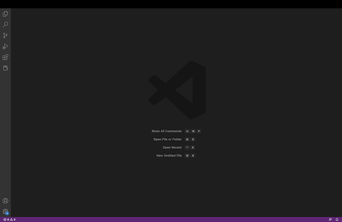
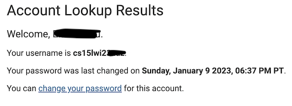
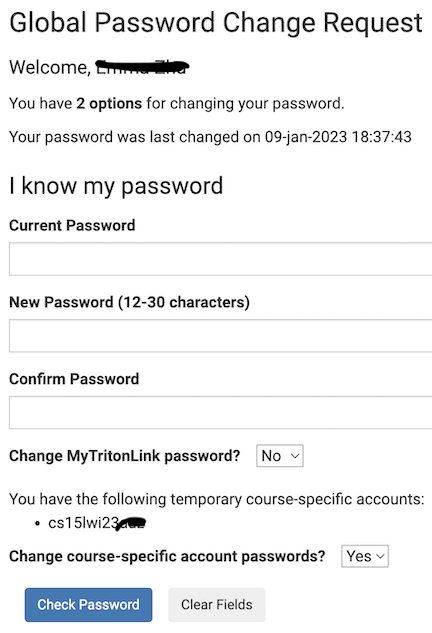
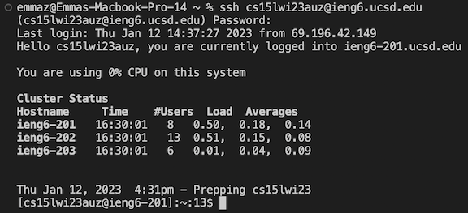
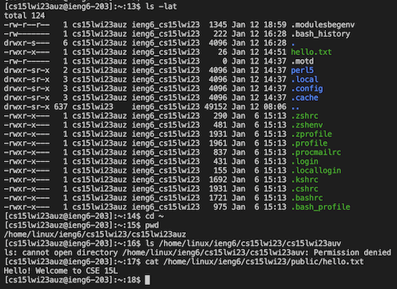

CSE 15L Week 1 Lab Report
---

During the week 1 lab of CSE 15L, we worked on downloading VSCode, logging into a remote server, as well as trying some commands within the terminal of the remote server. This report will briefly detail and describe the steps it took to complete the actions listed above. 

Downloading VSCode:
---
First, I went to the site where the link to download VSCode is located ([Link](https://code.visualstudio.com/)). After dowloading and installing the app, I opened it and the screen looked like the image below:

Now that VSCode was downloaded, I moved onto logging into the remote server.

Remotely Connecting
---
In order to connect remotely to the UCSD servers, I first determined my unique account username for this course through logging into this link ([Link](https://sdacs.ucsd.edu/~icc/index.php)) as shown below:

Using the account username, I then changed my password for that course specific account using the Global Password Change Request:

After completing these steps, I then went to the terminal within VSCode and used the following command to log into my remote server and the following screen appeared. However, since I had previously logged in to test my account password, the screen shown below is not the same as when I logged in for the first time.

Thus, I was able to successfully log into my remote server using my CSE 15L account username.

Running Some Commands
---
Mainly using the commands listed in the lab description, I ran some commands through the remote server and the results are as follows:
 

 
As seen in the image, the first command I ran was to list all the files in long format including hidden files as well as sort them from last modified date in descending order. The second command was to return to the root directory, then print the working directory. The fourth command was to access the directory of another group member through their CSE15L username. However, as expected, I did not have permission to do so. Lastly, I opened the file titled "hello.txt" and the output was a string with the contents of the file.

Conclusion
---
Overall, through the Week 1 lab, I was able to successfully complete:

* Downloading VSCode
* Logging into a remote server
* Running comands within the remote server

where the steps to do so are shown above and in the images. 

