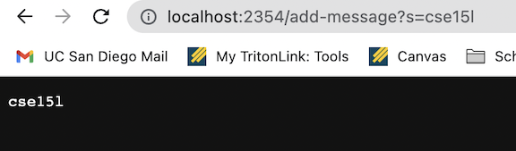

CSE 15L Week 3 Lab Report
---

During the last two weeks, we worked with creating web servers as well as learning about debugging, testing, and JUnit. Through this, certain vocabulary was also covered such as bugs, symptoms, symptom inducing inputs etc. As such, this lab is done to summarize these skills and excercises. 

Part 1: Creating a Simple Web Server
---

In this part of the lab, I worked on creating a web server that prints out messages stored in the query of the URL. The idea is to input a URL with the form of:

`/add-message?s=<string>`

If the format is correct, the string will be added and printed within the web server. In order to implement this, I create a file called **StringServer.java** with the following code:

```
import java.io.IOException;
import java.net.URI;
import java.util.ArrayList;

class HandlerOne implements URLHandler {

    ArrayList<String> string = new ArrayList<String> ();

    public String handleRequest(URI url) {
        String result = "";
        if (url.getPath().equals("/add-message") && url.getQuery() != null) {
            String[] parameters = url.getQuery().split("=");

            if (parameters[0].equals("s")) {
                string.add(parameters[1]);
            }

            for (String e: string) {
                result = result + e + "\n";
            }

            return result;
        }

        else {
            for (String e: string) {
                result = result + e + "\n";
            }

            return result + "cannot add new string; must have format: /add-message?s=<string>";
        }
    }
}

class StringServer {
    public static void main(String[] args) throws IOException {
        if(args.length == 0){
            System.out.println("Missing port number! Try any number between 1024 to 49151");
            return;
        }

        int port = Integer.parseInt(args[0]);

        Server.start(port, new Handler());
    }
}
```

Notice how numerous methods and class constructors are called which come from a public class **Server.java** which we used in Week 2 as well. 

**Running the Web Server**
After compiling the server using `javac StringServer.java` as well as running the server using `java StringServer 2354`, the following commands were used to change the URL:



In this image, the URL is seen to be changed to `/add-message?s=cse15l`. As seen in the image, the string "cse15l" was printed on the screen. This happens since the code in StringServer.java above calls the Handler class which in turn calls the public method handleRequest where the argument is the URL of the server. handleRequest's class initializes an arraylist which is where all the strings that are being added is stored. By having the proper format for adding a string, the URL handler then splits the query by "=" into an array. Thus, the actual string section is stored in the 1st index of the array. As such, the new string is added into the arraylist object as the last element. I also initialized a string object that will eventually be returned to hold the final string that will be printed onto the web server. This string called "result" has every element in the arraylist being added to it through a for loop along with a new line element so each string is printed on a new line.

In the case of the image above, arraylist is originally empty. When the URL is changed to `/add-message?s=cse15l`, we split the query into a list split by "=". Thus, the array becomes [s,cse15l]. Taking the last element, the arraylist adds the string "cse15l" as its first element. Once the for loop runs, the string result becomes "cse15l \n" which is returned to print on the server.
