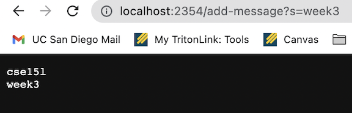
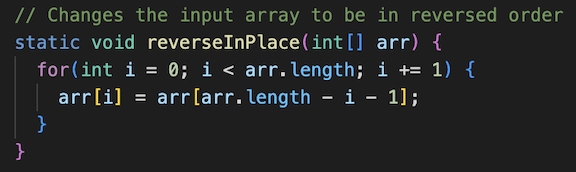
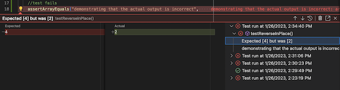
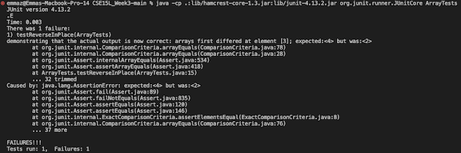
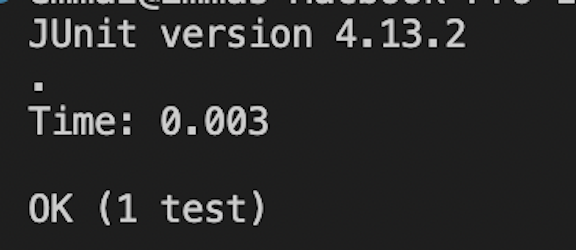

CSE 15L Week 3 Lab Report
---

During the last two weeks, we worked with creating web servers as well as learning about debugging, testing, and JUnit. Through this, certain vocabulary was also covered such as bugs, symptoms, symptom inducing inputs etc. As such, this lab is done to summarize these skills and excercises. 

Part 1: Creating a Simple Web Server
---

In this part of the lab, I worked on creating a web server that prints out messages stored in the query of the URL. The idea is to input a URL with the form of:

`/add-message?s=<string>`

If the format is correct, the string will be added and printed within the web server. In order to implement this, I create a file called **StringServer.java** with the following code:

```
import java.io.IOException;
import java.net.URI;
import java.util.ArrayList;

class HandlerOne implements URLHandler {

    ArrayList<String> string = new ArrayList<String> ();

    public String handleRequest(URI url) {
        String result = "";
        if (url.getPath().equals("/add-message") && url.getQuery() != null) {
            String[] parameters = url.getQuery().split("=");

            if (parameters[0].equals("s")) {
                string.add(parameters[1]);
            }

            for (String e: string) {
                result = result + e + "\n";
            }

            return result;
        }

        else {
            for (String e: string) {
                result = result + e + "\n";
            }

            return result + "cannot add new string; must have format: /add-message?s=<string>";
        }
    }
}

class StringServer {
    public static void main(String[] args) throws IOException {
        if(args.length == 0){
            System.out.println("Missing port number! Try any number between 1024 to 49151");
            return;
        }

        int port = Integer.parseInt(args[0]);

        Server.start(port, new Handler());
    }
}
```

Notice how numerous methods and class constructors are called which come from a public class **Server.java** which we used in Week 2 as well. 

**Running the Web Server**

After compiling the server using `javac StringServer.java` as well as running the server using `java StringServer 2354`, the following commands were used to change the URL:


In this image, the URL is seen to be changed to `/add-message?s=cse15l`. As seen in the image, the string "cse15l" was printed on the screen. This happens since the code in StringServer.java above calls the Handler class which in turn calls the public method handleRequest where the argument is the URL of the server. handleRequest's class initializes an arraylist which is where all the strings that are being added is stored. By having the proper format for adding a string, the URL handler then splits the query by "=" into an array. Thus, the actual string section is stored in the 1st index of the array. As such, the new string is added into the arraylist object as the last element. I also initialized a string object that will eventually be returned to hold the final string that will be printed onto the web server. This string called "result" has every element in the arraylist being added to it through a for loop along with a new line element so each string is printed on a new line.

In the case of the image above, arraylist is originally empty. When the URL is changed to `/add-message?s=cse15l`, we split the query into a list split by "=". Thus, the array becomes [s,cse15l]. Taking the last element, the arraylist adds the string "cse15l" as its first element. Once the for loop runs, the string result becomes "cse15l \n" which is returned to print on the server.

Another example is shown below:



In this example, a very similar situation is also happening. The arraylist currently holds ["cse15l"]. However, once we change the url to `add-message?s=week3`, this prompts the handleRequest method to run again while passing in this URL as its parameter. Then, this method will split the query into the following array: [s,week3]. By taking the last element in this array, we can add it to the arraylist from before. As such, the arraylist then becomes ["cse15l, week3]. Running the for loop again causes the string object, result, to change each loop. The first loop, result goes from "" --> "cse15l \n". The second loop, result goes from "cse15l \n" --> "cse15l\nweek3\n" where the "\n" represents a new line indentation so the two strings show up on seperate lines. As such, the web server shows the two messages in seperate lines. 

Part 2: Debugging Using JUnit
---

For this section of the lab report, I will be looking at the exercise of debuggin the provided code of printing an array in reverse.

The first exercise that was provided within the starter code of the file titled **ArrayExamples.java** is as follows:

```
// Changes the input array to be in reversed order
static void reverseInPlace(int[] arr) {
  for(int i = 0; i < arr.length; i += 1) {
    arr[i] = arr[arr.length - i - 1];
  }
}
```

An image of this code is also shown below through VSCode:



However, if we try and test this code through JUnit with the input of `int[] = {1,2,3,4,5}`, we can do the following:

```
@Test
public void testReverseInPlace() {   
    int[] input2 = {1,2,3,4,5}
    ArrayExamples.reverseInPlace(input2);
    //test fails
    assertArrayEquals(new int[] {5,4,3,2,1}, input2);
    
    //demonstrating the actual output of the incorrect method
    assertArrayEquals(new int[] {5,4,3,4,5}, input2);
}
```

Through this, we can see that the input of {1,2,3,4,5} produces a failure in that the output was not correct based on the functionality of the method we are testing. The failure-inducing input of {1,2,3,4,5} can be seen in the image below as an error through JUnit:

 


As seen in the image, the test that failed was the input of {1,2,3,4,5}. This means, there is a bug in the code that is inducing this failure. However, if we pass in {3} as the input, there is no error:

```
@Test
public void testReverseInPlace() {
    int[] input1 = {3};
    ArrayExamples.reverseInPlace(input1);
    //test passes
    assertArrayEquals(new int[] {3}, input1);
}
```

The JUnit test results in the following:



Thus, it is clear that some inputs are resulting in failures and some are resulting in a pass. However, there is still a bug that we need to find in order for all the inputs to pass. Thus, the code was changed in the following matter:

```
// Changes the bugs in the input array to be in reversed order
static void reverseInPlace(int[] arr) {
  for(int i = 0; i < arr.length/2; i += 1) {
    int temp = arr[i];
    arr[i] = arr[arr.length - i - 1];
    arr[arr.length - i - 1] = temp;
  }
}
```

As seen above, the incorrect code was due to the fact that the reversal of the array only reversed the first half of the array. Since the elements of the first half of the array were replaced by the second half of the array, there was no variable that stored the initial first half elements. Thus, when the second half was looped through, the first half was already replaced by the second half and the second half therefore did not change since the original first half elements were never stored anywhere. That is why I introduced a variable named temp that stores the initial values of the first half of the elments so the second half will sucessfull be replaced by the first half elements. In addition, I changed the loop to only loop through the first half of the array since I chose to switch the element in the first half and the corresponding element in the last half in one loop. Thus, I was able to fix the bug and the tests described above now worked. 

Part 3
---

Through the last two weeks, I learned about how to use JUnit tests to test methods i order to debug buggy code as well as learning about the different types of vocabulary such as bug, symptom, failure-inducing input etc. I found these really useful especially within CSE12 which I am concurrrently taking with CSE 15L. In addition, I also worked on getting more practice using git commands such as cloning and commiting. Lastly, I learned how to insert code blocks in markdown through the exercise of this lab report!
