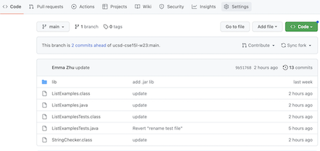

This week, we worked on using git commands as well as shortcuts to speed up our typing in terminal. In doing so, we did a competiion where we competed to see how fast we were to complete a series of steps. The steps for the competition are below:

9 Steps:
---
1. Delete any existing forks of the repository you have on your account
2. Fork the repository
3. The real deal Start the timer!
4. Log into ieng6
5. Clone your fork of the repository from your Github account
6. Run the tests, demonstrating that they fail
7. Edit the code file to fix the failing test
8. Run the tests, demonstrating that they now succeed
9. Commit and push the resulting change to your Github account (you can pick any commit message!)

Step 1: Delete fork
---
For this step, I first deleted the existing forks of the repository on my github account. The following steps are shown below:

In this step, the upper right corner of the nav bar shows the setting tab for the lab7 repository that is forked. Going to the settings page, scroll down until you reach the section shown in the image below:

As seen here, there is the option to delete this repository. Choosing the "Delete this repository" option, there are a couple authorization steps which once completed, the repository is now gone. An example of an authorization question is shown below:

Once completed, the lab7 fork is now deleted and my github account no longer can access this repository. Thus, step 1 has been achieved.

Step 2: Re-fork
---
In this step, I forked a new copy of the lab7 repository through the following steps:

In this image, the button with the grey text next to it is highlighted. Clicking this button will bring up the following image:

By completing all the details that this page is asking for, a new forked version of the lab7 repository will be created. Thus, the second step is completed.

Step 3: Start Timer
---
In this step, a simple stopwatch or timer is started to signify the beginning of the steps which are timed. In this image below, the default google stopwatch is used. By clicking start, the timer will start.

Step 4: ssh
---
In this step, we can open our terminal and ssh into our CSE15L remote account as seen in the following image:

After typing: `ssh cs15lwi23auz@ieng6.ucsd.edu` into the terminal, it should not prompt for a password due to the ssh key we generated in class today. Thus, we have successfully ssh'ed into our ieng6 account!

Step 5: Clone
---
In order to clone the lab7 repository that we forked, we can copy paste the ssh clone link we find on github under the green code icon. In the terminal we can type the following:

`git clone git@github.com:emmaz12/lab7.git`
  
The following image demonstrates this step as well:

Step 6: Run Test; Fail
---
In this step, I compiled then ran all the test files to see the errors as seen in the image below:

First: type `cd la <tab>` which will autocomplete into `cd lab7`

Then: type `<Ctrl R> javac` This will bring up a past command I ran to compile the files. The exact command it will bring up is the following
`javac -cp .:lib/hamcrest-core-1.3.jar:lib/junit-4.13.2.jar *.java`

Lastly, type `<Ctrl R> java -cp` which will again bring up a past command to run the tester file. The exact command is `java -cp .:lib/hamcrest-core-1.3.jar:lib/junit-4.13.2.jar org.junit.runner.JUnitCore ListExamplesTests`

Running these commands will cause an error and a test failure message. In the following steps, we will fix this.

Step 7: Fix bug
---
This step is where we fix the bug. The following commands and images are shown to demonstrate the steps:

We can first open an editor through the terminal using the following commands: 

`nano ListExam<tab>` will autocomplete to `nano ListExamples` which we can further specify by typing `.j <tab>`. This overall will give us the command of `nano ListExamples.java`. 

Next, we can edit the file going to the bugs location. In order to get to the location, I did the following steps: `<Ctrl V> <Ctrl V> <up> <up> <up> <up> <up> <up> <up> <right> <right> <right> <right> <right> <right> <right> <right> <right> <right> <right>`. This command moves the cursor to the bottom of the file where the bug is then 7 arrow clicks up and 11 arrow clicks to the right. 

Then, I made the edit by deleting the original `1` and replacing it with `2`. 

In order to save and exit the nano editor, the following keys were pressed: `<Ctrl O>`. This brought up the following image:

After pressing `<enter>`, I then pressed `<Ctrl X>` to exit the nano editor. 

This image shows the options related to the editor.

Step 8: Pass tests
---
Now, if we run the java tests again the following image appears:

In order to do so, the following commands were used:

`<up> <up> <up>` in order to retrieve the old command which was 3 commands up of `javac -cp .:lib/hamcrest-core-1.3.jar:lib/junit-4.13.2.jar *.java`. Then I pressed: `<up>  <up> <up>` to retrive the previous command 3 commands up of `java -cp .:lib/hamcrest-core-1.3.jar:lib/junit-4.13.2.jar org.junit.runner.JUnitCore ListExamplesTests`. Running these the same as how I ran them previously we get the image above.

Thus, we fixed the bug and the tester file now passes!

Step 9: Commit and Push
---
In order to commit our changes and push them back to github so the remote repository has the corrected version of the java file, the following is done:

First we need to add the files to let the terminal know which files we want to commit.

By typing in: `git add ListExamples.j <tab>`, the terminal autocompletes into `git add ListExamples.java`. Next we can commit this change by typing: `git commit -m "fixed bugs"` which will assign the commit message of "fixed bugs" to this change. Lastly, we can type: `<Ctrl R> git p` in which my terminal searches in reverse and finds the same command I used previously. Thus, it autocompletes it into `git push`. Once we run this, our file has been pushed onto the github repository!

The image below demonstrates the steps above:

If we go back to our git repository we can see proof of our edit once we open the ListExamples.java file as seen below:

Thus, we successfully pushed our changes back to the git repository!

Conclusion
---
Through this lab, we worked on learning how to use git commands such as add, commit, push to update our repositories with edits from our terminal. In addition, we worked on learning about shortcuts in terminal to speed the process of typing and using commands up
