Introduction
---
In this lab report, I will be recreating the tasks from Lab Report 4. I especially liked this lab report since we worked on learning how to better use commands in a more efficient manner. Within this lab, however, I will be creating a bash script that will automatically reproduce all the steps within Lab Report 4. This should be definitely faster than the steps shown in Lab 4! 

9 Steps to Recreate In a Bash Script
---
1. Delete any existing forks of the repository you have on your account
2. Fork the repository
3. The real deal Start the timer!
4. Log into ieng6
5. Clone your fork of the repository from your Github account
6. Run the tests, demonstrating that they fail
7. Edit the code file to fix the failing test
8. Run the tests, demonstrating that they now succeed
9. Commit and push the resulting change to your Github account (you can pick any commit message!)

**Note**
Steps 1 and 2 will not be done through the bash script since we have not learned how to fork a github repository or delete existing forks through terminal, although, I believe this can't be done anyways through git commands via terminal. As such, these steps will be assumed to be completed when writing and using the bash script created at the end of this lab. In addition, step 3 and 4 will be done outside of the bash script. For instance, we can start a timer through google or your phone, then log into ieng6 and complete the following tasks.

Step 1: Delete forks 
---
Check out my write up for lab report 4 to see how to do this step in detail!

Step 2: Fork
---
Check out my write up for lab report 4 to see how to do this step in detail!

Step 3: Start the Timer
---
Using a stopwatch or timer on your phone or google, we can start the timer before logging into ieng6 and stop it after we complete the last step.

Step 4: Log into ieng6
---
Using ssh, we can log into ieng6 using `ssh cs15lwi23auz@ieng6.ucsd.edu`. This will log us into the remote shell. After that, the bash script we will create will be a file within this account that we can call using `bash script.sh`. This will run the script for us and complete the remaining steps.

Writing the Bash Scrip
---
In this section, most steps will be implemented through a bash script with corresponding images to demonstrate this. In order to do so, we will first log into ieng6 then call a bash script created within the ieng6 remote ssh. Thus, the timer will begin before logging into ieng6, then after logging in, I will call a bash script that completes the steps 5-9 for me automatically. After that, we can stop the timer.

This section will demonstrate how to write the bash script for the remaining steps 5-9. 

Step 5: Clone your fork
---
In this step, we will first check if the clone already exists as a directory within the remote ssh. If it does exists, we will remove it and clone a new, fresh copy from the fork we created. This step is shown in the following image:

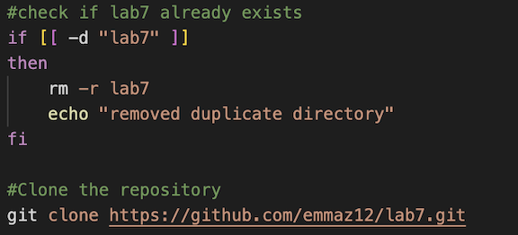

As seen in the image, we first use an `if` statement to check if the directory names lab7 already exists. If it does exist, we will delete it and echo that we have removed the duplicate. Then, we can call git clone to clone a new copy from the fork. 

After running the bash script with this new edit, the following result is seen:

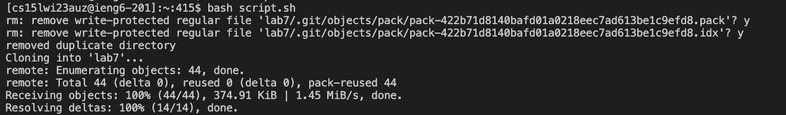

As shown above, it seems that another version of lab7 exits, so we delete it and clone a new fresh copy. 

Step 6: Run Tests, Show they Fail.
---
In this step, we will compile and run the test file to demonstrate they failed. This is done in the bash script as seen in the image below:

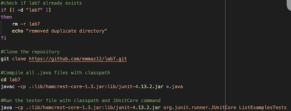

As seen in the image, we first compile all the `.java` files in the directory then run the test file. The result of this is shown in the following image:

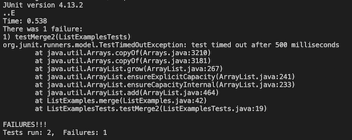

As seen, when we run the bash script with this new edit, the tester file has a failure that we need to fix.

Step 7: Fix bugs
---
As we know from lab report 4, the bug is in line 43 of the ListExamples.java file where the correct line should say `index2 +=1` however, the actual line is `index1 +=1` in order to fix this bug, we can add the following command in our bash file:

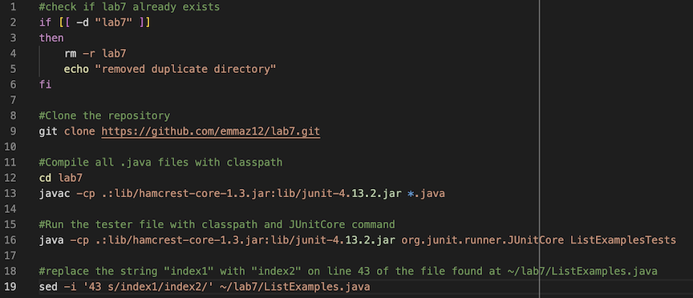

After doing some research and asking ChatGPT, I found a way to edit a file through terminal and overwrite the existing file to have that edit. In essence, the sed command replaces the string `index1` on line 43 with `index2`. The option -i means to overwrite the original file of ListExamples.java to have the change within it. This is seen if we cat our ListExample.java file after running the bash script with the new edit to it:

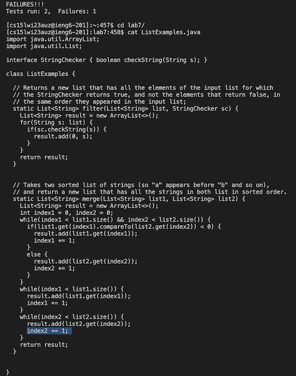

As seen in the above image, we ran script.sh again and saw the same failure as before. However, this time, the script also ran the new command of `sed`. To see the result of this command, I went to the location of the ListExamples.java file and used the cat command to view the file. As expected, line 43 where it used to say "index1" now says "index2"

Step 8: Run Again and Show Success
---
Now, we can add to the bash script to run the tester file again and see the result on our terminal. The image below shows the new command added to the bash file!

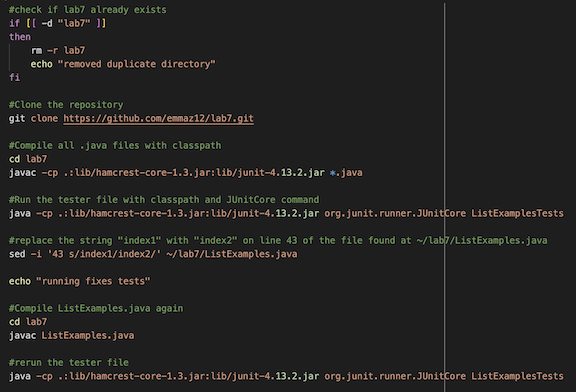

After recompiling the ListExamples.java file and re-running the tester file within the bash script, we can run the bash script again and the following shows up:

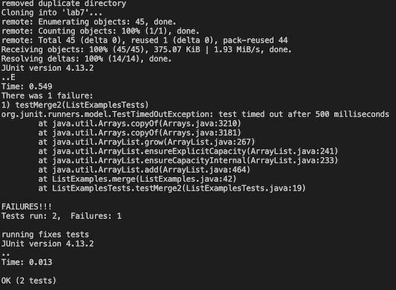

It looks like the test passed now! So far, the bash script seems to be working well!

Step 9: Commit
---
Now we can commit our new changes back to our github repository and push these commits back to our fork. We can add the following commands to the bash script:

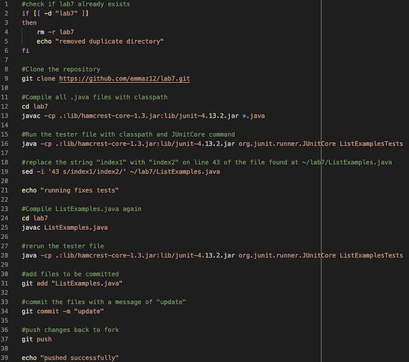

Once we add this to our bash script, we can rerun the script and the following appears:

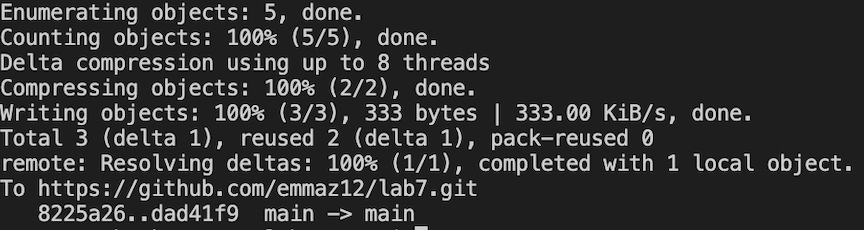

It seems like our commit and push worked! We can verify this by checking the lab7 fork within github and checking to see if ListExamples.java was updated. 

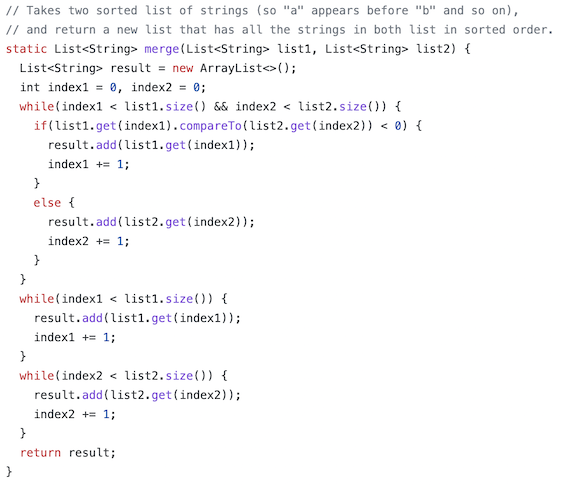

It looks like it was updated!

Conclusion
---
Through the bash script we wrote in this lab report, we can quickly complete the tasks described in lab report 4. As such, these steps can be completed much faster using a bash script that completes these tasks for us. Overall, I thought it was interesting to apply the knowledge we gained about bash scripts and how to write them in order to redo/recreate the lab tasks from lab 4. As seen in this report, we are successful in creating a bash script that will complete lab 4 for us in a much quicker manner.
